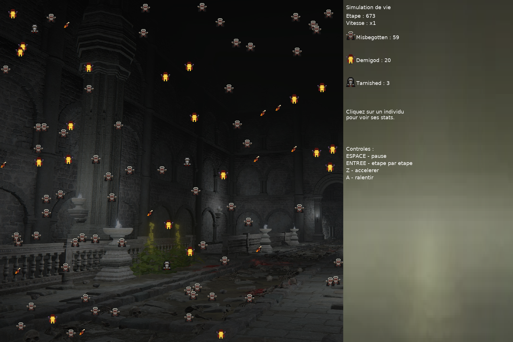
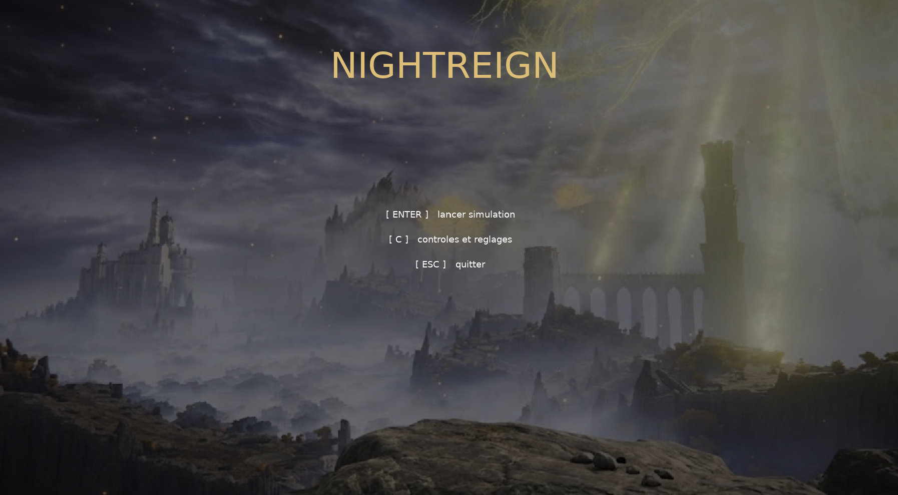
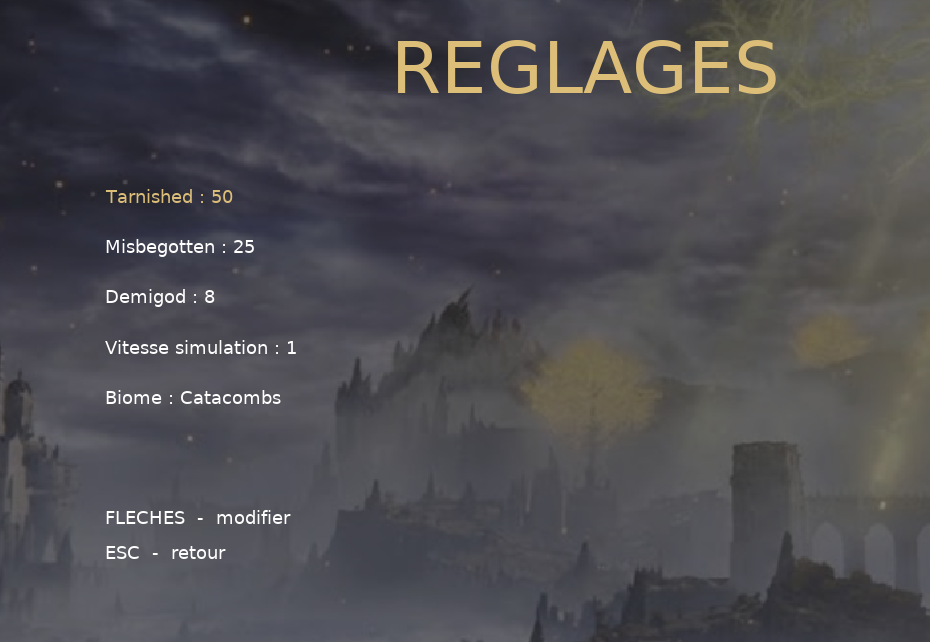
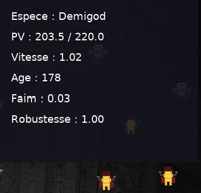

# 2D Ecosystem Simulation in C / SDL2



A real-time ecosystem simulation developed in C using SDL2 as part of my first-year engineering studies at ESIEA.

The project simulates the interactions between multiple species with different characteristics, including movement, hunger, predation, reproduction with genetic variation, aging, and population evolution in a dynamic environment.

---

## Features

- 🌍 Real-time 2D ecosystem simulation
- ⚔️ Predator-prey interactions
- 🍖 Hunger and food system
- ❤️ Health and aging mechanics
- 👶 Reproduction with inherited traits and random mutations
- 📊 Individual statistics panel
- ⚙️ Configurable simulation parameters
- 🗺️ Multiple environments (Catacombs / Oldcastle)
- 🎨 Custom pixel-art characters drawn directly with SDL2

---

## Screenshots

### Main Menu



---

### Simulation Settings



---

### Individual Statistics



---

## Technologies

- C
- SDL2
- SDL2_image
- SDL2_ttf
- SDL2_mixer

---

## Concepts Demonstrated

This project demonstrates several software engineering concepts:

- Dynamic memory management
- Structures and pointers
- Modular simulation logic
- Event-driven programming
- Collision detection
- Randomized behaviors
- Object interaction systems
- Rendering using SDL2
- User interface programming
- Audio and texture management

---

## Project Structure

```text
.
├── src/
├── docs/
│   └── screenshots/
├── IMAGES/
├── SONS/
├── README.md
└── .gitignore
```

---

## Controls

| Key | Action |
|------|--------|
| ENTER | Start simulation / Advance one frame |
| SPACE | Pause / Resume |
| Z | Increase simulation speed |
| A | Decrease simulation speed |
| ESC | Pause menu |
| Mouse | Select an individual |

---

## What I Learned

Through this project I gained practical experience with:

- Designing a large application in C
- Managing dynamic memory safely
- Building a real-time simulation
- Using the SDL2 multimedia library
- Organizing complex game logic
- Creating custom pixel-art graphics
- Implementing interactive graphical interfaces

---

## Future Improvements

Planned improvements include:

- Better pathfinding and AI
- More complex ecosystems
- Additional species
- Save/load simulation state
- Improved code modularization
- Performance optimizations

---

## Author

**Akshat Vyas**

First-year Engineering Student  
ESIEA Engineering School

GitHub: https://github.com/Akshatvs